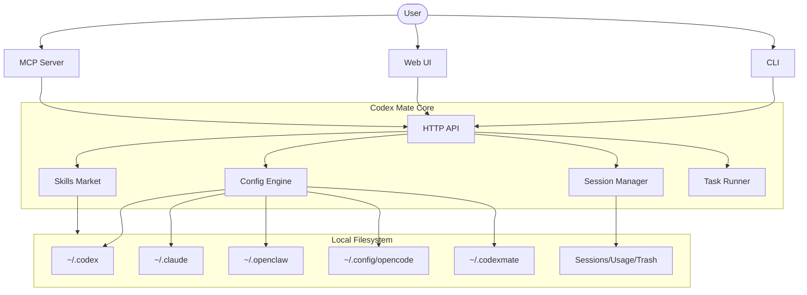

# 架构总览

用户 → CLI / Web UI / MCP → HTTP API → 核心(配置引擎/会话管理/Skills/任务) → 本地文件系统。

## 各层职责

| 层 | 职责 |
| --- | --- |
| 入口 | CLI / Web UI / MCP stdio 三个面向用户的入口 |
| HTTP API | 统一后端,承接三入口调用 |
| 配置引擎 | 写各工具配置,首轮接管有备份,可回滚 |
| 会话管理 | 聚合多工具会话,搜索/预览/导出/清理 |
| Skills Market | 跨 agent 应用导入导出 |
| 任务运行器 | DAG 编排与执行日志 |
| 本地 FS | 配置与会话/用量/回收站落盘 |

## 设计要点

- 本地优先:配置写本地目录,不碰云端账号。
- 隔离:每个工具的配置路径独立,首轮接管有备份。
- 不替代:只做管理层,原工具照常运行。

## 下一步
架构之外看 [Web UI 集中管理](/guide/web-ui) 实操,或了解 [设计边界](/guide/limits)。
